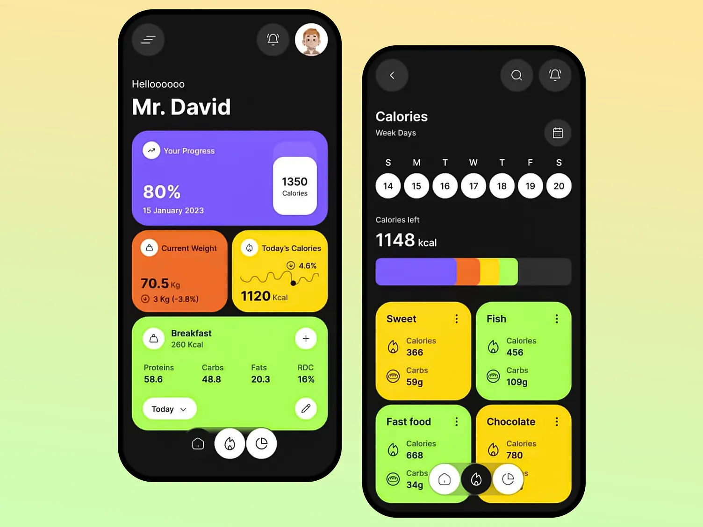

design Reference 

---

# 🥗 AI Calories App

## 🎨 Detailed UI/UX Design Document (Based on Provided Reference)

---

# 1️⃣ Design Language Overview

### Design Style

* Dark theme primary
* Neon-accent vibrant cards
* Rounded soft UI
* High contrast typography
* Playful yet premium

### Visual Personality

* Energetic
* Motivational
* Data-driven
* Fitness-focused

---

# 2️⃣ Color System (From Reference)

## 🎨 Background

* Primary Background: #0F0F0F (Near Black)
* Secondary Surface: #1A1A1A

---

## 🌈 Accent Card Colors

| Type            | Color             | Usage               |
| --------------- | ----------------- | ------------------- |
| Purple          | #7C5CFF           | Progress card       |
| Yellow          | #FACC15           | Sweet / Chocolate   |
| Green           | #86EFAC           | Healthy food        |
| Orange          | #FB923C           | Weight              |
| Gradient Purple | #6D28D9 → #A78BFA | Progress background |

---

## 🔥 Progress Ring

* Active: Orange #FB923C
* Inactive: Dark Gray #2A2A2A

---

# 3️⃣ Typography System

## Headings

* Font: Inter / SF Pro
* Weight: 700
* Large size (28–32px)

Example:
“Mr. David”

---

## Subheadings

* Weight: 600
* Size: 16–18px

---

## Data Numbers

* Bold
* Extra large
* High contrast white
* Tight letter spacing

Example:
80%
1120 Kcal
1148 kcal

---

# 4️⃣ Layout System

## Spacing System

Use 8pt grid system:

* 8px
* 16px
* 24px
* 32px

Consistent internal padding inside cards:
16–20px

---

# 5️⃣ Screen Breakdown

---

# 🏠 1. Home Dashboard Screen

## Top Bar

Left:
☰ Menu icon

Right:
🔔 Notification
👤 Profile Avatar (rounded)

---

## Greeting Section

Text:
Hellooooo
Mr. David

Large bold typography

Spacing:
24px below header

---

## 🟣 Progress Card (Primary Hero Component)

### Layout:

Large horizontal rounded card
Gradient purple background

Left:

* “Your Progress”
* 80%
* Date

Right:
White mini-card showing:
1350 Calories

### UX Behavior:

* Smooth progress animation on load
* Slight elevation shadow
* Press interaction scale effect

---

## 🟠 Current Weight Card

Color: Orange
Data:
70.5 kg
3kg (-3.8%)

Includes:
Small trend icon

UX:

* Shows positive change in green
* Negative in red

---

## 🟡 Today’s Calories Card

Yellow background
Shows:
1120 Kcal
Small mini line graph

UX:

* Micro animated graph
* Tap opens detailed view

---

## 🟢 Meal Card (Breakfast Example)

Large green card
Rounded corners
Contains:

* Meal name
* Calories
* Protein
* Carbs
* Fats
* RDC %

Bottom left:
“Today” dropdown

Bottom right:
Edit icon

UX:
Expandable on tap

---

## Bottom Navigation (Floating Style)

3 circular buttons:

* Home
* Fire (Calories)
* Timer/History

Middle active highlighted:
Black circle + white icon

Design:
Floating pill background

---

# 📊 2. Calories Screen

---

## Header

Title:
Calories

Sub:
Week Days

---

## Week Date Selector

Horizontal circular date buttons

Selected:
White circle
Black text

Unselected:
Dark circle
White text

UX:
Horizontal scrollable

---

## Calories Left Section

Large:
1148 kcal

Below:
Multi-color progress bar

Segments:
Purple
Orange
Yellow
Green

UX:
Animated fill on load

---

## Food Category Cards

Grid layout (2 columns)

Cards:

* Sweet
* Fish
* Fast Food
* Chocolate

Each card includes:

* Calories
* Carbs
* Small icon
* Three-dot menu

UX:
Press → opens detail modal

---

# 📈 3. Summary Screen

---

## Circular Progress Ring

Center:
820 Kcal

Design:
Orange thick stroke
Dark track background

UX:
Smooth animated draw

---

## Water Level Card

White card on dark background
Rounded top corners
Wave-style yellow chart

Dropdown:
This Week

UX:
Wave animation subtle

---

## Bottom Vertical Stats Bars

Vertical rounded bars:
1148
615
20.8
50.2
26%

UX:
Bars animate from bottom

---

# 6️⃣ Component Library (Based on Design)

Create reusable components:

* GradientCard
* StatsCard
* MealCard
* CircularProgress
* MultiSegmentBar
* FloatingNavBar
* DateSelector
* CategoryCard
* MiniLineChart
* WaterWaveChart

---

# 7️⃣ Interaction Design

## Animation Style

* Duration: 250–400ms
* Easing: ease-in-out
* Use Reanimated for:

  * Progress ring
  * Card hover
  * Bottom nav transitions

---

## Micro-Interactions

* Card scale 0.97 on press
* Ripple or opacity feedback
* Haptic feedback on confirm
* Smooth tab transitions

---

# 8️⃣ UX Psychology

### Motivation Strategy

Bright colors = dopamine trigger
Large percentage = instant clarity

### Data First Design

Numbers are large and dominant
No clutter

---

# 9️⃣ Accessibility

* High contrast text
* Minimum 44px tap targets
* Clear icon meanings
* Avoid color-only meaning (add labels)

---

# 🔟 Dark Theme Implementation Rules

* Avoid pure black (#000000)
* Use soft dark (#0F0F0F)
* Cards must pop visually
* Maintain strong white typography

---

# 11️⃣ Design Consistency Rules

* Border radius: 20px (large cards)
* Small radius: 12px (mini cards)
* Consistent icon size: 20–24px
* All cards have same shadow elevation

---

# 12️⃣ Developer Implementation Notes (Expo)

Use:

* expo-linear-gradient (for purple progress card)
* react-native-svg (progress ring)
* react-native-reanimated
* react-native-gesture-handler
* Victory Native or Recharts equivalent

---

# 13️⃣ Improvements You Can Add

To make it even more premium:

* Glassmorphism overlay
* Subtle background blur
* Gradient animated backgrounds
* Smart motivational messages
* Daily streak badge

---

# 🎯 Final UX Goal

When user opens app:
They instantly see:

* Progress
* Weight change
* Today’s calories
* Clear remaining count

No confusion. No clutter. Just clarity.

---

